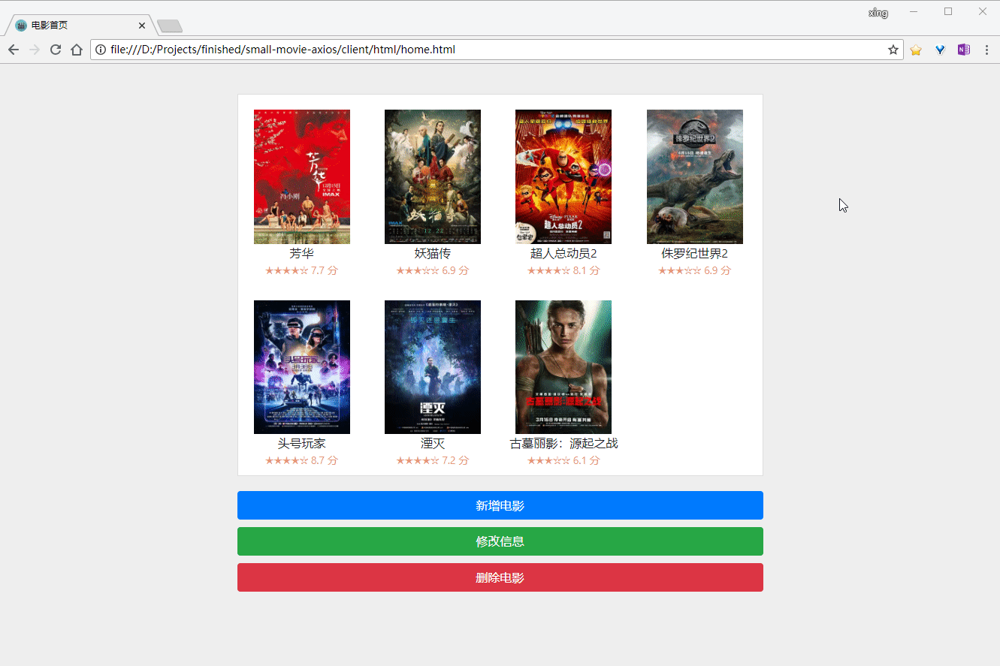

## axios + json-server 小案例

### 演示



### 如何使用

```sh
$ git clone https://github.com/ifkingx/small-movie-axios

$ cd small-movie-axios

$ npm install

$ npm install -g json-server

$ json-server api/db.json --watch
```

访问 home.html

### 第三方库说明

- [json-server](https://github.com/typicode/json-server) 用来模拟服务器 API

- [axios](https://www.kancloud.cn/yunye/axios/234845) 用来请求 API

### Notes

- 如果父容器没给固定高度的话，多个字容器想要直接平铺在内是不行的，当超出宽度的时候会丢失父容器，可将子容器声明为行内块级元素

```css
display: inline-block
```

- 子容器 `posttion: absolute` 不生效时可将父容器声明为 `position: relative`

- 某些标签浏览器会自动加上一些 `margin` 或 `padding`，可用如下方式清除

```css
*{
    margin: 0;padding: 0
}
```

- 当有表单要提交的时候不能监听 `click` 事件，否则不论表单是否验证通过，下面的代码都会执行。需要监听 `submit` 事件，此时监听的 `id` 是表单 id 而不是按钮的

- axios + json-server 进行 CRUD 操作

```js
axios.get('http://localhost:3000/movies')
    .then(function (response) {
        // 查询数据
        if (response.data) {
            console.log("查询成功！")
        }
        const movies = response.data
    })
    .catch(function (error) {
        console.log(error)
    })
```

```js
axios.delete(`http://localhost:3000/movies/${selectId}`)
    .then(function (response) {
        if (response.status == 200) {
            // 删除数据
            console.log("删除成功！")
        }
    })
    .catch(function (error) {
        console.log(error)
    })
```

```js
axios.post('http://localhost:3000/movies', getMovieData())
    .then(function (response) {
        if (response.data) {
            // 添加数据
            alert("添加成功！")
        }
    })
    .catch(function (error) {
        console.log(error)
    })

    function getMovieData() {
        let tagElements = document.getElementsByTagName('input')
        let movieData = {}
        for (let item of tagElements) {
            movieData[item.name] = item.value
        }
        movieData['id'] = selectId
        return movieData
    }
```

进行编辑操作可先删后增。